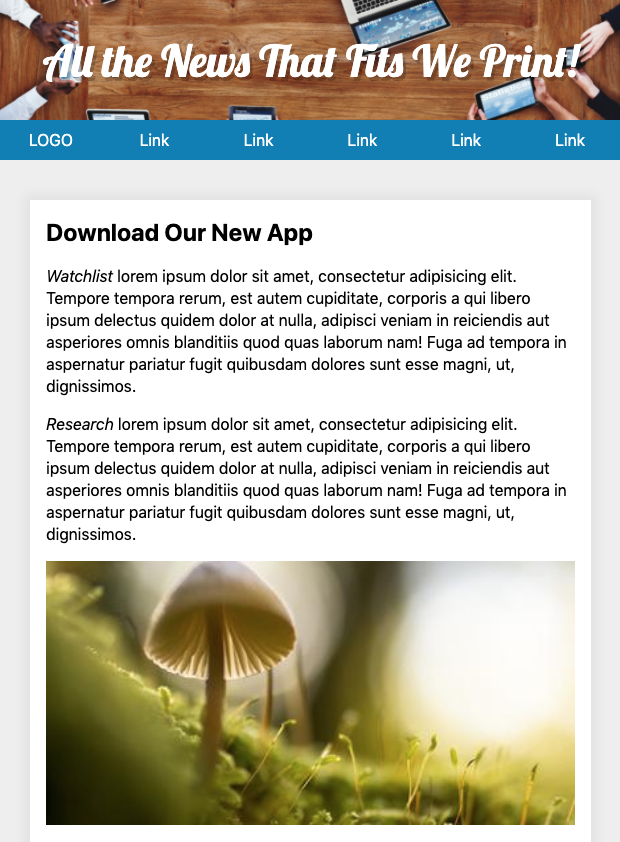

# Introduction

1. There is no such thing as a silly question, you are encouraged to speak up anytime something is not clear to you
2. There is no such thing as a silly mistake, they are a gateway to learning
3. Do not dismiss someone because they have a different level of experience - be kind to others
4. During class exercises you promise to alert me the second something goes awry with your project
5. I will make myself available after class to clarify or expand on topics (or we can set an alternate time via email)

## Resources

Your instructor - Daniel Deverell (he, him): Front & Back end developer at Barclays specializing in CSS, JavaScript, React and Node

- 6/6/2019 - 8/15/2019
- 6:30 PM - 9:30 PM
- Instructor: Daniel Deverell, [Email](mailto:daniel.deverell@nyu.edu) - `daniel.deverell@nyu.edu`
- [Syllabus](https://docs.google.com/document/d/1UAXDYO9RkSi8WI3tXmvtm-6dWtkuBf8LypxTwHkpq8w)
- [LinkedIn](https://www.linkedin.com/in/danieldeverell/) - `https://www.linkedin.com/in/danieldeverell/`

### Github

[Github](https://github.com/front-end-intermediate) - `https://github.com/front-end-intermediate`, is the source for _all files_ used in this class. Each class's activities will be documented in a readme file.

You can download a zip file from Github using the green "Clone or Download" menu and selecting "Download ZIP."

Please keep the page open in a tab during class for reference and in order to copy and paste code.

The edited files as they existed at the end of class can be downloaded from the `*-done` branch of this and all subsequent Github repositories. Be sure to select the branch on Github _before_ downloading the zip. I will demonstrate this in class.

### Reading

Online reading and videos will be assigned.

## Homework

Homework should be handed in by uploading the files to the NYU server and alerting me via email - daniel.deverell@nyu.edu.

## Today's Homework

- Install [Git](https://git-scm.com)
- Install [NodeJS](https://nodejs.org)
- Create a Github account
- Review the JavaScript Algorithms and Data Structures Certification at [Free Code Camp](https://www.freecodecamp.org/learn). Start with the Basic JavaScript lessons and then proceed to the ES6 section. You should try to complete these sections before the third class. If you want to get ahead - or if the intro exercises are too easy - do the Object Oriented and Function Programming sections.

---

## Summary of Tools and Technology

A listing of applications and technologies you will be introduced to in the class include:

- HTML, CSS and JavaScript
- React, NODE, MongoDB, ExpressJS
- Visual Studio Code and the Terminal
- Git and Github
- SASS and Styled Components - for CSS

## VSCode

In today's class we will implement [this single page web site](http://oit2.scps.nyu.edu/~devereld/intermediate/session1/) with content almost entirely generated using JavaScript (try selecting `view > developer > View Source` in Chrome).

In creating this page we will focus on techniques that are critical, not just for working effectively with DOM manipulation, but for React and other JavaScript frameworks.

The following are used in today's class:

- [Visual Studio Code](https://code.visualstudio.com/)
- [Node.js](https://nodejs.org/en/)
- [Google Chrome](https://www.google.com/chrome/)

In this class we will be using [Visual Studio Code](https://code.visualstudio.com/) as our editor. We will discuss its features on an as-needed basis.

Start VSCode, press `cmd + shift + p` and type in the word `shell`. Select `Install code command in PATH`.


---

### Aside: VSCode Extensions

Install Prettier in VSCode and edit the project settings in the `.vscode` directory as per the instructions to enable format on save for JavaScript.

Install Quokka and Live Server in VS Studio code

Optional: install Bracket Pair Colorizer in VSCode. `({[({{{{{{{}}}}}}})]})`

---

<!-- end aside -->

---

## The Command Line

You are going to need to have a minimal set of terminal commands at your disposal.

Windows users should use the Git Bash terminal that is installed along with Git.

Start the terminal app (Mac OS) or Git Bash (Windows).

```sh
cd  // change directory
cd ~  // go to your home directory
cd <PATH>  // Mac: copy and paste the folder you want to go to
cd Desk  // tab completion
cd ..  // go up one level
ls  // list files, dir on a PC
ls -al  // list file with flags that expand the command
pwd  // print working directory
```

`cd` into today's working directory and type:

```sh
code .
```

## Node Package Manager

[Node Package Manager](https://www.npmjs.com) (NPM) is an essential part of the web design and development ecosystem. [Node](https://nodejs.org/en/) includes Node Package Manager (NPM) as part of its install.

Open the integrated terminal in VSCode (`View > Terminal`) with `ctrl ~`.

For our first foray into NPM we will install and use [Browser Sync](https://www.browsersync.io) for hot reloading.

```sh
npm init -y
```

- `npm init -y` creates `package.json` - examine it.

```sh
$ npm install browser-sync --save-dev
```

- `npm install browser-sync --save-dev` installs [Browser Sync](https://www.browsersync.io) into a newly created `node_modules` folder
- `--save-dev` adds browser-sync to a list of development dependencies in `package.json`

### NPM Scripts

`package.json` contains a single script by default. NPM scripts are very powerful but can be difficult to write - primarily because the documentation is hard to find or cryptic.

One hint is to always look for the command line documentation for any software you've installed via NPM. NPM scripts are best viewed as command line instructions which can be called by node.

Here is the documentation for browser-sync:

- Browser Sync [Command Line (CLI) documentation](https://www.browsersync.io/docs/command-line)
- [Github Repo](https://github.com/BrowserSync/browser-sync)

Create the NPM script in `package.json` using the Browser Sync command line documentation:

```js
"scripts": {
  "start": "browser-sync start --server 'app' --files 'app'"
},
```

And run the process using VS Code's embedded terminal (View > Terminal):

```sh
npm run start
```



This will open `index.html` in your browser. If it opens in a browser other than Chrome, start Chrome and copy and paste the URL into a new tab in Chrome.

## DOM Scripting

The HTML DOM (Document Object Model) specification allows JavaScript to access and manipulate the elements of an HTML document.

The process we will use is:

1. Select an html element
2. Add an event listener to the selected element
3. Create commands to run when the event occurs

### .querySelectorAll()

Use `document.querySelectorAll('selector')` to find all matching elements on a page. You can use any valid CSS for the selector.

In the browser's console:

```js
> var elems = document.querySelectorAll('.main-menu li');
```

Returns a [NodeList](https://developer.mozilla.org/en-US/docs/Web/API/NodeList).

### .querySelector()

Use `document.querySelector()` (without the 'All') to find the first matching element on a page.

In the browser's console:

```js
> var elem = document.querySelector('.main-menu a');
```

Returns an HTML element or Node.

---

### Aside - A Common Source of Errors

If an element isn’t found, `querySelector()` returns `null`.

```js
> var elem = document.querySelector('.foo');
```

If you try to do something with a nonexistent element you'll get an error (pretty common). You typically check that a matching element was found before deciding what to do:

```js
if (!elem) {
  console.log("Can't find the link.");
} else {
  console.log('Found the link.');
}
```

---

<!-- end aside -->

## Looping - for and forEach()

In JavaScript, you can use a `for` to loop through array and node list items.

```js
var elems = document.querySelectorAll('.main-menu a');

for (let i = 0; i < elems.length; i++) {
  console.log(i); // index
  console.log(elems[i]); // accessor > value
}
```

ES6 introduced a new [`forEach()`](https://developer.mozilla.org/en-US/docs/Web/JavaScript/Reference/Global_Objects/Array/forEach) method for looping over arrays.

You pass a [callback function](https://developer.mozilla.org/en-US/docs/Glossary/Callback_function) into `forEach()`. The first argument is the current item in the loop. The second is the current index in the array.

Unlike a for loop, you can’t terminate the `forEach()` function before it’s completed with `break`.

```js
var elems = document.querySelectorAll('.main-menu a');

elems.forEach(function(item, index) {
  console.log(index); // index
  console.log(item); // value
});
```

### Array.from()

The `.forEach()` method works with arrays _and_ NodeLists. The `NodeList.forEach()` method has decent but not universal browser support at this time so it is common to convert NodeLists into Arrays with the `Array.from()` method and use `forEach()` on that:

```js
var elems = Array.from(document.querySelectorAll('.main-menu a'));

elems.forEach(function(item, index) {
  console.log(item);
  console.log(index);
});
```

Note: greater backwards compatibility can be acheived with:

`Array.prototype.slice.call(document.querySelectorAll('.main-menu a'));`

## EXERCISE I - Generating Content From an Array

We will begin by replacing the existing nav with items from an array using a `for loop`.

Note the two script tags at the bottom of `index.html`:

```html
<script src="js/navitems.js"></script>
<script src="js/myscripts.js"></script>
```

Examine `navitems.js`.

Note the difference between `navItemsObject` and `navItemsArray`. The latter is an array of values while the former offers an array of objects consisting of key/value pairs.

In the console:

```js
> navItemsArray;
> navItemsObject;
```

Select the element with the class `.main-menu` In `myScripts.js`:

```js
const nav = document.querySelector('.main-menu');
```

To select all the links in nav we could try:

```js
const navList = document.querySelectorAll('#main-menu li a');
```

But here it is perhaps a bit more efficient to use `element.querySelector` (as opposed to `document.querySelector`):

```js
const nav = document.querySelector('.main-menu');
const navList = nav.querySelectorAll('li a');
```

Compare `navList` and `navItemsArray` in the console and note the `prototypes` in the inspector.

- `navList` is from our JavaScript: `const navList = nav.querySelectorAll('li a');`
- `navItemsArray` is from '`navItems.js`.)

Both have a length property - `navList.length` and `navItemsArray.length`.

Note that we have 8 items in the `navItemsArray` but only 6 in our `navList`.

Replace our placeholder nav items with content from an array

- use a `for` loop and `innerHTML`:

```js
const nav = document.querySelector('.main-menu');
const navList = nav.querySelectorAll('li a');

for (let i = 0; i < navList.length; i++) {
  console.log(i);
  navList[i].innerHTML = navItemsArray[i];
}
```

The `innerHTML` property can be used to both get and set HTML content in an element.

In the console:

```js
var elem = document.querySelector('.site-wrap');

// Get HTML content
var html = elem.innerHTML;

// Set HTML content
elem.innerHTML =
  'We can dynamically change the HTML to include <a href="#">HTML elements</a>.';
```

We are using the six existing `<li>` elements in the DOM but there are 8 items in our `navItemsArray` array.

We need to dynamically generate the nav from items in the array.

Edit the HTML:

```html
<nav id="main-menu" class="main-menu" aria-label="Main menu">
  <a
    href="#main-menu-toggle"
    id="main-menu-close"
    class="menu-close"
    aria-label="Close main menu"
  >
    <span class="sr-only">Close main menu</span>
    <span class="fa fa-close" aria-hidden="true"></span>
  </a>
  <ul></ul>
</nav>
```

Note: the [responsive hamburger menu technique](https://medium.com/@heyoka/responsive-pure-css-off-canvas-hamburger-menu-aebc8d11d793) used in today's sample required that we leave the first link in place. See the article and `nav.css` for more information.

Append a `<ul>` tag to nav using:

1. [document.createElement()](https://vanillajstoolkit.com/reference/dom-injection/#createelement) creates an element, e.g. `var div = document.createElement('div');`.
2. [append](https://vanillajstoolkit.com/reference/dom-injection/#append).

JavaScript offers a number of methods to determine the insertion point.

```js
// Create a new HTML element and add some text
var div = document.createElement('div');
div.textContent = 'Hello world';

// Get the element to add your new HTML element before, after, or within
const target = document.querySelector('.main-menu');

// Inject the `div` element before the element
target.before(div);

// Inject the `div` element after the element
target.after(div);

// Inject the `div` element before the first item *inside* the element
target.prepend(div);

// Inject the `div` element after the first item *inside* the element
target.append(div);
```

Let's append a new div to the (now empty) nav.

Delete eveything in `myscripts` and add:

```js
const nav = document.querySelector('.main-menu');

const navList = document.createElement('ul');
navList.textContent = 'Hello world';
nav.append(navList);
```

Note the `<ul>` in the header.

Dynamically create the nav based on the number of items in the array using a for loop:

```js
const nav = document.querySelector('.main-menu');

const navList = document.createElement('ul');

for (let i = 0; i < navItemsArray.length; i++) {
  let listItem = document.createElement('li');
  let linkText = navItemsArray[i];
  listItem.innerHTML = '<a href="#">' + linkText + '</a>';
  navList.append(listItem);
}

nav.append(navList);
```

Our nav bar now displays all the items in our array but the code is ugly. This is an example of [imperative programming](https://tylermcginnis.com/imperative-vs-declarative-programming/). In order to prepare for React we need to adopt a more declarative style.

We will use [Functional Programming](https://medium.com/javascript-scene/master-the-javascript-interview-what-is-functional-programming-7f218c68b3a0) techniques. (See the `filter` examples `students.js` in today's `other` folder.)

---

### Aside - Template Literals

Note that we used single quotes in the construction of our innerHTML: `listItem.innerHTML = '<a href="#">' + linkText + '</a>'`. Compare old school concatenation and the variable 'sentence' bu running the following in the console:

```js
const name = 'Yorik';
const age = 2;
const oldschool = 'My dog ' + name + ' is ' + age * 7 + 'years old.';
const newschool = `My dog ${name} is ${age * 7} years old.`;
console.log('oldschool ', oldschool);
console.log('newschool ', newschool);
```

[Template Strings](https://developer.mozilla.org/en-US/docs/Web/JavaScript/Reference/Template_literals) use back ticks instead of quotes and have access to JS expressions inside plaeholders - `${ ... }`.

---

<!-- end aside  -->

Switch out the concatenation for a _template string_:

```js
for (let i = 0; i < navItemsArray.length; i++) {
  let listItem = document.createElement('li');
  listItem.innerHTML = `<a href="#">${navItemsArray[i]}</a>`;
  navList.appendChild(listItem);
}
```

Use `forEach()` instead of a for loop:

```js
navItemsArray.forEach(function(item) {
  let listItem = document.createElement('li');
  listItem.innerHTML = `<a href="#">${item}</a>`;
  navList.appendChild(listItem);
});
```

Use an arrow function in the final script:

```js
const nav = document.querySelector('.main-menu');

const navList = document.createElement('ul');

navItemsArray.forEach(item => {
  let listItem = document.createElement('li');
  listItem.innerHTML = `<a href="#">${item}</a>`;
  navList.appendChild(listItem);
});

nav.append(navList);
```

---

### Aside: React

Open for reference `other > React > 1-react.html` in a browser using [Live Server](https://marketplace.visualstudio.com/items?itemName=ritwickdey.LiveServer).

Since we will be spending much of our time this semester in React, it is worthwhile to point out at this time that React is an alternate way to create DOM elements.

The second file, `2-react-jsx.html`, uses [Babel](https://babeljs.io) to help create a DOM element.

---

<!-- end aside  -->

## EXERCISE II - Content Generation with an Array of Objects

So far we have been working with a simple array. However most of the data you will encounter will consist of an array of objects:

- [JSON Placeholder](https://jsonplaceholder.typicode.com/posts)
- [City Growth](https://gist.githubusercontent.com/Miserlou/c5cd8364bf9b2420bb29/raw/2bf258763cdddd704f8ffd3ea9a3e81d25e2c6f6/cities.json)
- The [New York Times API](https://api.nytimes.com/svc/topstories/v2/nyregion.json?api-key=uQG4jhIEHKHKm0qMKGcTHqUgAolr1GM0)
- and our navItemsObject:

```js
const navItemsObject = [
  {
    label: 'LOGO',
    link: '#'
  },
  {
    label: 'Watchlist',
    link: '#watchlist'
  },
  {
    label: 'Research',
    link: '#research'
  },
  {
    label: 'Markets',
    link: '#markets'
  },
  {
    label: 'Workbook',
    link: '#workbook'
  },
  {
    label: 'Connect',
    link: '#connect'
  },
  {
    label: 'Desktop',
    link: '#desktop'
  },
  {
    label: 'FAQ',
    link: '#faq'
  }
];
```

Add the links using `navItemsObject` instead of `navItemsArray`.

Note the the 'dot' accessor notation for dealing with an object and the addition of the anchor tags:

```js
navItemsObject.forEach(function(item) {
  let listItem = document.createElement('li');
  listItem.innerHTML = `<a href="${item.link}">${item.label}</a>`;
  navList.appendChild(listItem);
});
```

Navigate and inspect the code and note that we now have anchor tags with page fragment links in our html and are able to navigate within our page.

Add page fragment links:

```html
<body id="top">
  <a href="#top">Back to top</a>
</body>
```

### Aside: Objects

Open `other > javascript > Objects > objects.html` in a browser tab.

Examine the sample object in the browser console:

```sh
last
me
me.links
var twitter = me.links.social.twitter
```

Add to script block:

```js
const { twitter, facebook } = me.links.social;
```

```js
const { twitter: twit } = me.links.social;
```

This is an example of [destructing](https://developer.mozilla.org/en-US/docs/Web/JavaScript/Reference/Operators/Destructuring_assignment) - a JavaScript expression that makes it possible to unpack values from arrays, or properties from objects, into distinct variables. We will be using it extensively in this class.

Create a multi-line template string and display it on the page:

```js
const content = `
<div>
  <h2>
    ${me.first} ${me.last}
  </h2>
    <span>${me.job}</span>
    <p>Twitter: ${twitter}</p>
    <p>Facebook: ${facebook}</p>
</div>
`;
document.body.innerHTML = content;
```

---

<!-- end aside  -->

### Array Methods

We'll use another method for developing our nav - using Array methods `map`, `filter` and arrow functions.

#### [Array.prototype.filter()](https://developer.mozilla.org/en-US/docs/Web/JavaScript/Reference/Global_Objects/Array/filter)

Note the inventors sample data in `navitems.js`:

```js
const inventors = [
  { first: 'Albert', last: 'Einstein', year: 1879, passed: 1955 },
  { first: 'Isaac', last: 'Newton', year: 1643, passed: 1727 },
  { first: 'Galileo', last: 'Galilei', year: 1564, passed: 1642 },
  { first: 'Marie', last: 'Curie', year: 1867, passed: 1934 },
  { first: 'Johannes', last: 'Kepler', year: 1571, passed: 1630 },
  { first: 'Nicolaus', last: 'Copernicus', year: 1473, passed: 1543 },
  { first: 'Max', last: 'Planck', year: 1858, passed: 1947 }
];
```

Filter the list of inventors for those who were born in the 1500's.

In the console:

```js
const fifteen = inventors.filter(function(inventor) {
  if (inventor.year >= 1500 && inventor.year <= 1599) {
    return true; // keep it
  }
});

console.table(fifteen);
```

#### Arrow Functions

[Arrow functions](https://developer.mozilla.org/en-US/docs/Web/JavaScript/Reference/Functions/Arrow_functions) are commonly used as a shorter syntax for anonymous functions although they have additional functionality

Refactor using an arrow function with implicit return:

```js
const fifteen = inventors.filter(
  inventor => inventor.year >= 1500 && inventor.year < 1600
);
console.table(fifteen);
```

Note the lack of a `return` statement. While they can be used within arrow functions, they are often unnecessary as the `return` is implicit.

#### [Array.prototype.map()](https://developer.mozilla.org/en-US/docs/Web/JavaScript/Reference/Global_Objects/Array/map) and [join()](https://developer.mozilla.org/en-US/docs/Web/JavaScript/Reference/Global_Objects/Array/join)

The map method transforms a collection by applying a function to all of its elements and building a new collection from the returned values.

Provide an array of the inventors first and last names:

```js
var fullNames = inventors.map(function(inventor) {
  return `${inventor.first} ${inventor.last}`;
});

console.log('Full names: ' + fullNames);
```

Notice the commas separating the names.

Refactor it to use an arrow function and join the results with a slash:

```js
const fullNames = inventors
  .map(inventor => `${inventor.first} ${inventor.last}`)
  .join(' / ');

console.log('Full names: ' + fullNames);
```

## EXERCISE III - Using Array.prototype.map()

Let's try creating the list items using `map()` and template strings:

```js
const nav = document.querySelector('.main-menu');

const markup = `
    <ul>
      ${navItemsObject.map(function(item) {
        return `<li><a href="${item.link}">${item.label}</a></li>`;
      })}
    </ul>
    `;

console.log(markup);

nav.innerHTML = markup;
```

Join the array to avoid the comma:

```js
const markup = `
    <ul>
      ${navItemsObject
        .map(function(item) {
          return `<li><a href="${item.link}">${item.label}</a></li>`;
        })
        .join('')}
    </ul>
    `;
```

Finally, refactor using an arrow function:

```js
const markup = `
<ul>
  ${navItemsObject
    .map(item => `<li><a href="${item.link}">${item.label}</a></li>`)
    .join('')}
</ul>
`;
```

Note the use of nested template strings here.

These methods, `.map`, `.filter`, and others we have yet to look at such as `.reduce`, are _the prefered_ means of manipulating data today.

The close button which is an integral part of the responsive navigate has been lost due to the use of `nav.innerHTML = markup;`. There are a number of simple ways to resolve this. For today we'll just cut the code from `index.html` and paste the code into our JavaScript:

```js
const markup = `
<ul>
  <a
  href="#main-menu-toggle"
  id="main-menu-close"
  class="menu-close"
  aria-label="Close main menu"
  >
  <span class="sr-only">Close main menu</span>
  <span class="fa fa-close" aria-hidden="true"></span>
  </a>
  ${navItemsObject
    .map(item => `<li><a href="${item.link}">${item.label}</a></li>`)
    .join('')}
</ul>
`;
```

## EXERCISE - Sticky Menu

Problem: the menu scrolls off the screen and we want to to be available at all times.

Solution: we will anchor the menu to the top of the screen once the user has scrolled to the point where the menu would normally be out of sight using the css position property.

Edit the CSS in `nav.css` (inside the media query).

```css
.main-menu {
  display: block;
  position: static;
  background: #007eb6;
  width: 100%;
  position: sticky;
  top: 0px;
}
```

Note: this would be considered a progressive enhancement as it does not work in all the browsers. Support migh be extended by following the instructions on [Can I Use](https://caniuse.com/#feat=css-sticky).

## EXERCISE - Adding an SVG Image

Select the first list item on the nav, add a class and set the innerHTML so that we get a link which will return us to the top of the page:

```js
// logo
const logo = nav.querySelector('.main-menu ul li');
logo.classList.add('logo');
logo.innerHTML = '<a href="#"></a>';
```

Examine the SVG file

Some interesting applications of SVG:

- [Responsive logos](http://responsivelogos.co.uk)
- [Background generator](http://www.svgeneration.com/recipes/Beam-Center/)

Format the logo for both mobile and wide screen:

```css
li.logo img {
  padding-top: 0.25rem;
  width: 2.5rem;
}
```

Note the use of max-width above. We are using this because transitions do not animate width.

## EXERCISE VI - AJAX and APIs

_AJAX stands for Asynchronous JavaScript And XML. In a nutshell, it is the use of the XMLHttpRequest object to communicate with servers. It can send and receive information in various formats, including JSON, XML, HTML, and text files. AJAX’s most appealing characteristic is its “asynchronous” nature, which means it can communicate with the server, exchange data, and update the page without having to refresh the page._ - [Mozilla Developer Network](https://developer.mozilla.org/en-US/docs/Web/Guide/AJAX/Getting_Started)

An API (Application Programming Interface) is a set of subroutine definitions, communication protocols, and tools for building software. In general terms, it is a set of clearly defined methods of communication among various components. A good API makes it easier to develop a computer program by providing all the building blocks, which are then put together by the programmer.

### XHR

To start off we'll look at the classic `XMLHttpRequest()` browser API.

Making AJAX requests with the `XMLHttpRequest()` method, often referred to as `XHR`, is a three step process:

1. Set up our request by creating a new `XMLHttpRequest()`.
2. Create an `onreadystatechange` function to run when the request state changes.
3. Open and send our request.

We'll make requests data from [JSON Placeholder](https://jsonplaceholder.typicode.com/), a site that provides real API endpoints and sends back placeholder content for testing.

The XHR request will return with a status property that contains an HTTP status code. Codes from 200 to 299 are considered a success. Anything else is not.

We can check that our request was successful by making sure the `xhr.status` was greater than or equal to 200 and less than 300.

E.g.:

```js
// Set up our HTTP request
var xhr = new XMLHttpRequest();

// Setup our listener to process request state changes
xhr.onreadystatechange = function() {
  // Only run if the request is complete
  if (xhr.readyState !== 4) return;

  // Process our return data
  if (xhr.status >= 200 && xhr.status < 300) {
    // This will run when the request is successful
    console.log('success! ', xhr);
  } else {
    // This will run when it's not
    console.log('The request failed!');
  }

  // This will run either way
  // All three of these are optional, depending on what you're trying to do
  console.log('This always runs...');
};
```

Finally, we open our request, specifying the request type and the URL to make our request to.

Then, we send our request.

Try this in the console:

```js
var xhr = new XMLHttpRequest();

xhr.onreadystatechange = function() {
  if (xhr.readyState !== 4) return;

  // Process our return data
  if (xhr.status >= 200 && xhr.status < 300) {
    console.log('success!', xhr);
  } else {
    console.log('The request failed!');
  }

  console.log('This always runs...');
};

// Create and send a GET request
// The first argument is the post type (GET, POST, PUT, DELETE, etc.)
// The second argument is the endpoint URL
xhr.open('GET', 'https://jsonplaceholder.typicode.com/posts');
xhr.send();
```

Try: `console.log('success!', xhr.response);`

We used a GET request to get a list of posts from JSON Placeholder, but there are a handful of possible request types you can make. HTTP methods are typically verbs that describe what the request you're making does.

The four most common are GET, POST, PUT, and DELETE. You can see a list at the [Mozilla Developer Network](https://developer.mozilla.org/en-US/docs/Web/HTTP/Methods).

The way you send information to an API will vary from API to API. For example, to get post 42 on JSON Placeholder, you’d send a GET request to `https://jsonplaceholder.typicode.com/post/42`.

The most common response type from API calls is JSON - [JavaScript Object Notation](https://developer.mozilla.org/en-US/docs/Web/JavaScript/Reference/Global_Objects/JSON).

The response data can be accessed from the responseText property on the XMLHttpRequest object.

```js
var xhr = new XMLHttpRequest();
// ...
var data = xhr.responseText;
```

Here it is in context. (Note that this example requests only post number 10.)

Paste this into the console:

```js
var xhr = new XMLHttpRequest();

xhr.onreadystatechange = function() {
  if (xhr.readyState !== 4) return;

  if (xhr.status >= 200 && xhr.status < 300) {
    console.log(xhr.responseText);
  } else {
    console.log(xhr.responseText);
  }
};

xhr.open('GET', 'https://jsonplaceholder.typicode.com/posts/10');
xhr.send();
```

### `xhr.responseText` String to Object

The JSON response you get back may look like an object but is in fact a string (`console.log(typeof(xhr.responseText))`). In order to work with the data we need to convert it into a JavaScript object. You do this with the `JSON.parse()` method.

```js
// Convert data string to an object
var data = JSON.parse(xhr.responseText);
```

Once the data is an object we can work with it.

```js
// Get the first item
var firstPost = data[0];

// Loop through each post
data.forEach(function(post) {
  console.log(post);
});
```

Here it is in full context:

```js
// Set up our HTTP request
var xhr = new XMLHttpRequest();

// Setup our listener to process request state changes
xhr.onreadystatechange = function() {
  // if the request is complete
  if (xhr.readyState !== 4) return;

  // Process our return data
  if (xhr.status >= 200 && xhr.status < 300) {
    // successful
    console.log(JSON.parse(xhr.responseText));
  } else {
    // unsuccessful
    console.log(JSON.parse(xhr.responseText));
  }
};

xhr.open('GET', 'https://jsonplaceholder.typicode.com/posts');
xhr.send();
```

Try:

- `console.log(xhr.responseText);` - and compare this to `console.log(JSON.parse(xhr.responseText));`
- `console.log(typeof(JSON.parse(xhr.responseText)));` - returns string

## EXERCISE - Adding Content

We will use the [NY Times developer](https://developer.nytimes.com) API for getting a data using my API key.

The specific API endpoint for this is their [top stories endpoint](https://developer.nytimes.com/docs/top-stories-product/1/overview). It lets us request the top stories from a specific section of their publication.

Start by removing the existing HTML content from the site-wrap div in `index.html` so you are left with an empty div:

```html
<div class="site-wrap"></div>
```

Store the API key, a template string with the complete URL, and the element we want to manipulate (`.site-wrap`) in a variable:

```js
var root = document.querySelector('.site-wrap');
const nytapi = 'uQG4jhIEHKHKm0qMKGcTHqUgAolr1GM0';
const nytUrl = `https://api.nytimes.com/svc/topstories/v2/travel.json?api-key=${nytapi}`;
```

### The fetch() API

The [Fetch API](https://developer.mozilla.org/en-US/docs/Web/API/Fetch_API/Using_Fetch) is a newer and easier to read alternative to XMLHttpRequest.

`fetch()` returns a [promise](https://developer.mozilla.org/en-US/docs/Web/JavaScript/Guide/Using_promises).

```js
fetch(
  'https://api.nytimes.com/svc/topstories/v2/travel.json?api-key=uQG4jhIEHKHKm0qMKGcTHqUgAolr1GM0'
).then(response => console.log(response));
```

```js
fetch(nytUrl).then(response => console.log(response));
```

That needs to be converted to JSON with `response.json()` (similar to `JSON.parse` above):

```js
fetch(
  'https://api.nytimes.com/svc/topstories/v2/travel.json?api-key=uQG4jhIEHKHKm0qMKGcTHqUgAolr1GM0'
).then(response => console.log(response.json()));
```

```js
fetch(nytUrl).then(response => console.log(response.json()));
```

We can then use the data in our app:

```js
fetch(nytUrl)
  .then(function(response) {
    return response.json();
  })
  .then(function(myJson) {
    console.log(myJson.results);
  });
```

Instead of logging it we will pass it to a `renderStories` function:

```js
fetch(nytUrl)
  .then(function(response) {
    return response.json();
  })
  .then(function(myJson) {
    renderStories(myJson);
  });
```

In `renderStories` we take the passed data (our JSON) and run a `forEach` on every item that creates a `div` with the desired content:

```js
function renderStories(data) {
  console.log(data);
}
```

```js
function renderStories(data) {
  data.results.forEach(function(story) {
    console.log(story);
  });
}
```

```js
function renderStories(data) {
  data.results.forEach(function(story) {
    var storyEl = document.createElement('div');
    storyEl.className = 'entry';
    storyEl.innerHTML = `
    <h3>${story.title}</h3>
    `;
    console.log(storyEl);
    root.prepend(storyEl);
  });
}
```

```js
function renderStories(data) {
  data.results.forEach(story => {
    var storyEl = document.createElement('div');
    storyEl.className = 'entry';
    storyEl.innerHTML = `
    
      <div>
        <h3><a target="_blank" href="${story.short_url}">${story.title}</a></h3>
        <p>${story.abstract}</p>
      </div>
      `;
    root.prepend(storyEl);
  });
}
```

Note: not all NYTimes stories include images and, depending on the day, our script could error if `story.multimedia[0]` was undefined. For this we will use a [Conditional (ternary) operator](https://developer.mozilla.org/en-US/docs/Web/JavaScript/Reference/Operators/Conditional_Operator)

```js
 0 ? story.multimedia[0].url : 'img/no-image.png'
    }"
  alt='${story.title}'
/>
```

Ternaries are popular in cases like this - in fact they are essential. Imagine trying to write an `if(){} else(){}` statement inside a string literal. It wouldn't work because template literals only support expressions.

Add some new css to support the new elements:

```css
.entry {
  display: grid;
  grid-template-columns: 1fr 7fr;
  grid-column-gap: 1rem;
  margin-bottom: 1rem;
}

.entry a {
  color: #007eb6;
  text-decoration: none;
}
```

Try: incrementing the `[0]` in the ternary.

Refactor using arrow functions and `.map()`:

```js
fetch(nytUrl)
  .then(response => response.json())
  .then(myJson => renderStories(myJson));

function renderStories(data) {
  data.results.map(story => {
    var storyEl = document.createElement('div');
    storyEl.className = 'entry';
    storyEl.innerHTML = `
     0 ? story.multimedia[2].url : 'img/no-image.png'
    }" alt="${story.title}" />
      <div>
        <h3><a target="_blank" href="${story.short_url}">${story.title}</a></h3>
        <p>${story.abstract}</p>
      </div>
      `;
    root.prepend(storyEl);
  });
}
```

## EXERCISE - Sections

_Warning_ - intense code ahead. Be sure to review this section.

Let's add additional Sections to our page.

Replace `navItemsObject.js` with

```js
const navItemsObject = [
  {
    label: 'arts',
    link: '#arts'
  },
  {
    label: 'books',
    link: '#books'
  },
  {
    label: 'fashion',
    link: '#fashion'
  },
  {
    label: 'food',
    link: '#food'
  },
  {
    label: 'movies',
    link: '#movies'
  },
  {
    label: 'travel',
    link: '#travel'
  }
];
```

Note: Arts does not appear in the nav. Edit the logo related scripts:

```js
// logo
const logo = document.createElement('li');
const navList = nav.querySelector('nav ul');
logo.classList.add('logo');
logo.innerHTML = '<a href="#"></a>';
navList.prepend(logo);
```

Add a categories and limit variable:

```js
const limit = 6;
const categories = ['arts', 'books', 'fashion', 'food', 'movies', 'travel'];
```

Since our categories are available in `navItemsObject`, we can simplify things by making the categories variable a product of `navItemsObject`:

```js
const limit = 6;
const categories = navItemsObject.map(item => item.label);
```

Create a new `getArticlesByCategory` function and call it with the categories array:

```js
function getArticlesByCategory(cat) {
  cat.forEach(function(category) {
    fetchArticles(category);
  });
}

getArticlesByCategory(categories);
```

This function's sole purpose is to call a new function `fetchArticles` with each of the items in our categories array.

Refactor our `fetch` call to a `fetchArticles` function that generates a url based on the section:

```js
function fetchArticles(section) {
  fetch(
    `https://api.nytimes.com/svc/topstories/v2/${section}.json?api-key=${nytapi}`
  )
    .then(response => response.json())
    .then(myJson => renderStories(myJson));
}
```

In the `renderStories()` function we begin by adding the title to a new div:

```js
function renderStories(data) {
  var sectionHead = document.createElement('div');
  sectionHead.id = data.section;
  sectionHead.innerHTML = `<h3 class="section-head">${data.section}</h3>`;
  root.prepend(sectionHead);
}
```

Prior to our `forEach` we will limit the number of stories with `stories = data.results.slice(0, limit);` and then append the sories to the sectionHead with `sectionHead.append(storyEl);`:

```js
function renderStories(data) {
  var sectionHead = document.createElement('div');
  sectionHead.id = data.section;
  sectionHead.innerHTML = `<h3 class="section-head">${data.section}</h3>`;
  root.prepend(sectionHead);

  stories = data.results.slice(0, limit); // NEW

  stories.map(story => {
    storyEl = document.createElement('div');
    storyEl.className = 'entry';
    storyEl.innerHTML = `
     0 ? story.multimedia[0].url : 'img/no-image.png'
    }" />
    <div>
      <h3><a target="_blank" href="${story.short_url}">${story.title}</a></h3>
      <p>${story.abstract}</p>
    </div>
    `;
    sectionHead.append(storyEl); // NEW
  });
}
```

---

### Array.slice(), Array.filter

Note the use of the Array method [`slice()`](<(https://developer.mozilla.org/en-US/docs/Web/JavaScript/Reference/Global_Objects/Array/slice)>) and our limit variable to constrain the number of articles displayed.

The `slice()` method returns a _shallow_ copy of a portion of an array into a new array.

Note also that we are adding an id (`sectionHead.id = data.section;`) to the section heads so that our navigation works.

Demo: Following up on our discussion of filtering arrays, here is a script that could be employed to return subsections within a section:

```js
// stories = data.results.slice(0, limit);
const stories = data.results.filter(
  story => story.subsection === 'Book Review'
);
```

---

Style the new category headers:

```css
.section-head {
  font-family: Lobster;
  font-weight: normal;
  color: #007eb6;
  font-size: 2.5rem;
  text-transform: capitalize;
  padding-bottom: 0.25rem;
  padding-top: 4rem;
  margin-bottom: 1rem;
  border-bottom: 1px solid #007eb6;
}
```

## Smooth Scrolling

```css
html {
  scroll-behavior: smooth;
}
```

## Final Script

```js
// variables
var root = document.querySelector('.site-wrap');
const nytapi = 'uQG4jhIEHKHKm0qMKGcTHqUgAolr1GM0';
const limit = 6;
const categories = navItemsObject.map(item => item.label);
const nav = document.querySelector('.main-menu');

// navigation
function renderNav() {
  const markup = `
  <ul>
    ${navItemsObject
      .map(
        item => `<li><a data-scroll href="${item.link}">${item.label}</a></li>`
      )
      .join('')}
  </ul>
  `;
  nav.innerHTML = markup;

  const logo = document.createElement('li');
  const navList = nav.querySelector('nav ul');
  logo.classList.add('logo');
  logo.innerHTML = '<a href="#"></a>';
  navList.prepend(logo);
}

// articles
function getArticlesByCategory(cat) {
  cat.forEach(function(category, index) {
    fetchArticles(category, index);
  });
}

function fetchArticles(section) {
  fetch(
    `https://api.nytimes.com/svc/topstories/v2/${section}.json?api-key=${nytapi}`
  )
    .then(response => response.json())
    .then(myJson => renderStories(myJson));
}

function renderStories(data) {
  var sectionHead = document.createElement('div');
  sectionHead.id = data.section;
  sectionHead.innerHTML = `<h3 class="section-head">${data.section}</h3>`;
  root.prepend(sectionHead);

  stories = data.results.slice(0, limit);

  stories.forEach(story => {
    storyEl = document.createElement('div');
    storyEl.className = 'entry';
    storyEl.innerHTML = `
     0 ? story.multimedia[0].url : 'img/no-image.png'
    }" />
    <div>
      <h3><a target="_blank" href="${story.short_url}">${story.title}</a></h3>
      <p>${story.abstract}</p>
    </div>
    `;
    sectionHead.append(storyEl);
  });
}

getArticlesByCategory(categories);
renderNav();
```

## Notes

### Immediately Invoked Function Expression

Move everything [out of](https://vanillajstoolkit.com/boilerplates/iife/) the global scope

```js
(function() {
  'use strict';

  // Code goes here...

})();
```

'use strict': with strict mode you can not use undeclared variables.

```js
const stories = data.results.slice(0, limit);

stories.forEach(story => {
const storyEl = document.createElement('div');
storyEl.className = 'entry';
storyEl.innerHTML = `
```

### Local Storage

Implement [local storage](https://gomakethings.com/saving-html-to-localstorage-with-vanilla-js/)

```js
function renderStories(data) {
  ...
 localStorage.setItem('articles', root.innerHTML);
 ...
}
```

At the bottom of scripts:

```js
let saved = localStorage.getItem('articles');
if (saved) {
  root.innerHTML = saved;
} else {
  getArticlesByCategory(categories);
}
```

In Chrome's inspector select Application and browser to Storage > Local Storage.

Time permitting:

```js
localStorage.setItem(
  'stories',
  JSON.stringify({
    timestamp: new Date().getTime(),
    data: stories
  })
);
```

Warning: not production code!

```js
let saved = localStorage.getItem('stories');
let savedJson = JSON.parse(saved);
console.log(savedJson);
console.log(savedJson.timestamp);
if (saved) {
  var difference = new Date().getTime() - savedJson.timestamp;
  console.log('difference ', difference);
  if (difference > 1000 * 5) {
    getArticlesByCategory(categories);
    console.log('true');
  } else {
    getArticlesByCategory(categories);
    console.log('false');
  }
}

// getArticlesByCategory(categories);
```

### Final HTML

```html
<!DOCTYPE html>
<html lang="en">
  <head>
    <meta charset="UTF-8" />
    <title>All the News</title>
    <link
      href="https://fonts.googleapis.com/css?family=Lobster&display=swap"
      rel="stylesheet"
    />
    <link rel="stylesheet" href="css/styles.css" />
  </head>

  <body>
    <header>
      <h1>All the News That Fits We Print!</h1>
    </header>

    <nav class="main"></nav>

    <div class="site-wrap"></div>

    <script src="js/navitems.js"></script>

    <script src="js/myscripts.js"></script>

    <script src="https://cdn.jsdelivr.net/gh/cferdinandi/smooth-scroll/dist/smooth-scroll.polyfills.min.js"></script>
    <script>
      var scroll = new SmoothScroll('a[href*="#"]', {
        speed: 500,
        easing: 'easeInOutQuad',
        offset: 50
      });
    </script>
  </body>
</html>
```

### Final CSS

```css
* {
  margin: 0;
  padding: 0;
}

body {
  font-family: -apple-system, BlinkMacSystemFont, 'Segoe UI', Roboto, Helvetica,
    Arial, sans-serif, 'Apple Color Emoji', 'Segoe UI Emoji', 'Segoe UI Symbol';
  line-height: 1.4;
}

html {
  box-sizing: border-box;
  background: #eee;
}

*,
*:before,
*:after {
  box-sizing: inherit;
}

.site-wrap {
  max-width: 90vw;
  margin: 40px auto;
  background: white;
  padding: 1rem;
  box-shadow: 0 0 10px 5px rgba(0, 0, 0, 0.05);
}

header {
  height: 320px;
  background: url(../img/img.jpg) center no-repeat;
  background-size: cover;
  display: flex;
  align-items: center;
  justify-content: center;
}

h1 {
  font-family: 'Lobster', cursive;
  font-weight: normal;
}

@media (max-width: 640px) {
  header {
    height: 120px;
  }
}

p {
  margin: 1rem 0;
}

h1 {
  color: white;
  font-size: 7vw;
  font-weight: 400;
  text-shadow: 3px 4px 0 rgba(0, 0, 0, 0.2);
}

nav {
  background: #007eb6;
  width: 100%;
  transition: all 0.5s;
  z-index: 1;
}

nav ul {
  list-style: none;
  display: flex;
  justify-content: center;
  align-items: center;
  height: 2.5rem;
}

nav li {
  flex: 1;
  text-align: center;
}

nav a {
  text-decoration: none;
  display: inline-block;
  color: white;
  text-transform: capitalize;
  font-weight: 700;
}

img {
  width: 100%;
}
body.fixed-nav nav {
  position: fixed;
  top: 0;
  box-shadow: 0 5px 3px rgba(0, 0, 0, 0.1);
  width: 100%;
  z-index: 1;
}
li.logo img {
  padding-top: 0.25rem;
  width: 2.5rem;
}
li.logo {
  max-width: 0;
  overflow: hidden;
  background: white;
  transition: all 0.5s;
}
.fixed-nav li.logo {
  max-width: 500px;
}
.entry {
  display: grid;
  grid-template-columns: 1fr 7fr;
  grid-column-gap: 1rem;
  margin-bottom: 1rem;
}

.entry a {
  color: #007eb6;
  text-decoration: none;
}
.section-head {
  font-family: Lobster;
  color: #007eb6;
  font-size: 2.5rem;
  text-transform: capitalize;
  padding-bottom: 0.25rem;
  /* padding-top: 4rem; */
  margin-bottom: 1rem;
  border-bottom: 1px dotted #007eb6;
}
```
